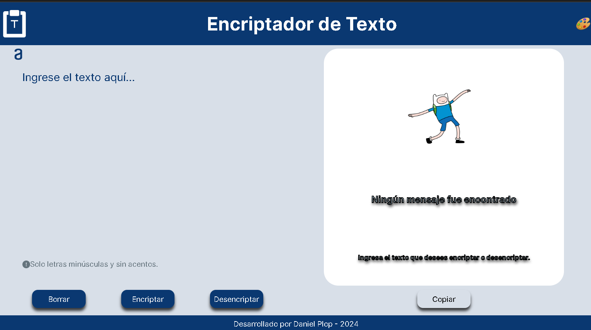

<h1>Encriptador de Texto</h1>

- Estado del proyecto: En Construcción

- Descripción del Proyecto: Página en la que un usuario introduce un texto encriptado, en letras minúsculas y sin acentos, y es desencriptado. 

También puede introducir un texto encriptado anteriormente y desencriptarlo.

Este es un ejemplo donde se muestra el proceso descrito y se alternan, aunque no hay necesidad de esto, los colores principales de la página.

- Tecnologías utilizadas: html, css, js.

- Personas Desarrolladoras del Proyecto: Daniel Plop