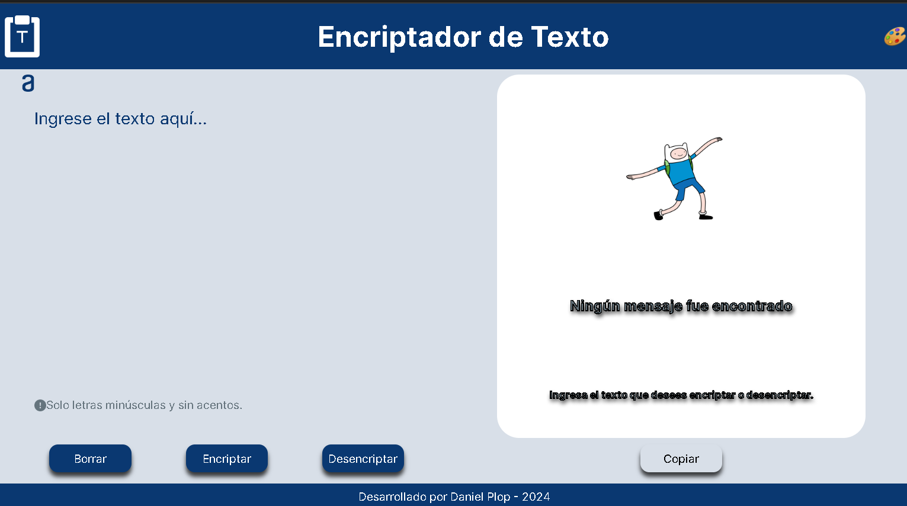
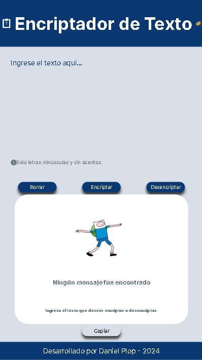
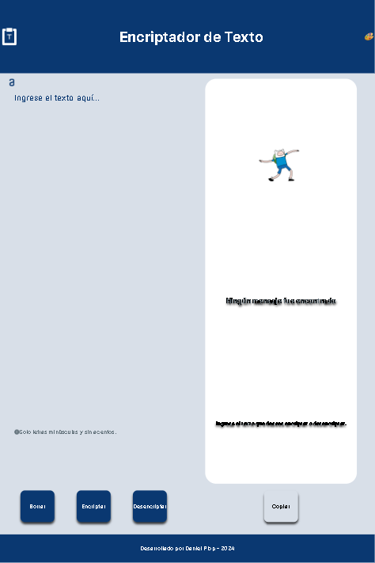
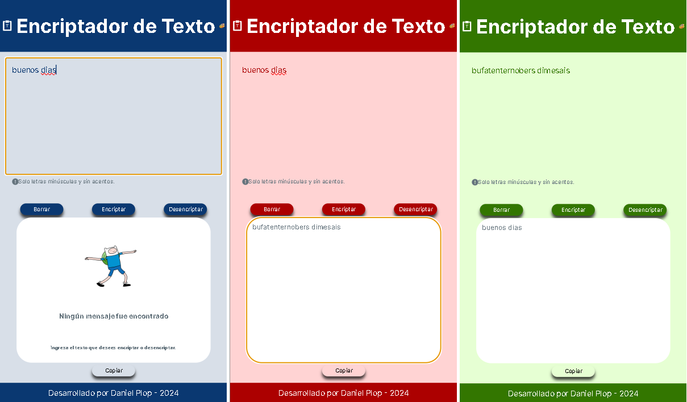

<h1>Encriptador de Texto</h1>

<strong>Estado del proyecto:</strong> Finalizado. En mejoramiento. (Vista de escritorio)
 

  

<strong>Descripción del Proyecto:</strong> Página en la que un usuario introduce un texto encriptado, en letras minúsculas y sin acentos, y es desencriptado. (vista en celular)
 

  

También puede introducir un texto encriptado anteriormente y desencriptarlo. (Vista en tablet)
 

  

Este es un ejemplo donde se muestra el proceso descrito y se alternan, aunque no hay necesidad de esto, los colores principales de la página. (Alternancia de colores principales) 

  

<strong>Tecnologías utilizadas:</strong> html, css, js. 

<strong>Personas Desarrolladoras del Proyecto:</strong> Daniel Pérez López